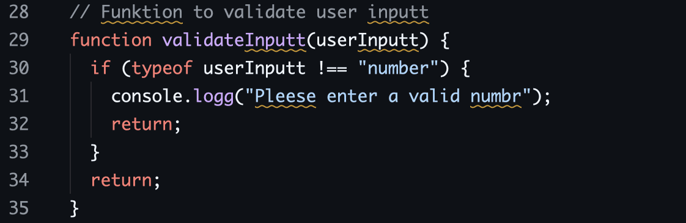

<br />
<div align="center">
  <a href="https://github.com/blopker/codebook">  </a> <h3
  align="center">CODEBOOK</h3> <p align="center"> An unholy spellchecker for
  code. <br /> <br /> <!-- <a
  href="https://github.com/blopker/codebook/releases/latest/">Download</a> -->
  <br /> <br /> <a href="https://github.com/blopker/codebook/issues">Report
  Bug</a> · <a href="https://github.com/blopker/codebook/issues">Request
  Feature</a> </p>
</div>

## Usage



No setup needed. Code book will automatically detect the language you are editing and mark issues for you. Note, Codebook will only mark issues for words that you control, where they are initially defined.

## Integrations

### Zed

Codebook is available for the Zed editor. To install, go to the Extension tab in Zed and look for "Codebook".

**Note**: The version that Zed displays in the extension menus is for the [Zed Extension](https://github.com/blopker/codebook-zed), and not the LSP version (this repo). The extension will automatically update the LSP. If that updater is broken for some reason, try uninstalling the extension and reinstalling.

### Helix

Codebook can also be enabled for the [Helix
editor](https://helix-editor.com/) by adding the LSP to the
[language.toml](https://docs.helix-editor.com/languages.html) configuration
file. Ensure that `codebook-lsp` is installed into your `$PATH` and add into
this file:

```toml
[language-server.codebook]
command = "codebook-lsp"
args = ["serve"]

# Example use in markdown:
[[language]]
name = "markdown"
language-servers = ["codebook"]
```

This can be verified with:

```shell
hx --health markdown
```

Suggestions will appear in files opened, and
[space-mode](https://docs.helix-editor.com/keymap.html#space-mode) `a` key
binding can be used to accept suggestions.

## About

Codebook is a spellchecker for code. It binds together the venerable Tree Sitter and the fast spell checker [Spellbook](https://github.com/helix-editor/spellbook). Included is a Language Server for use in (theoretically) any editor. Everything is done in Rust to keep response times snappy and memory usage _low_.

However, if you are looking for a traditional spellchecker for _prose_, Codebook may not be what you are looking for. For example, capitalization issues are handled loosely and grammar checking is out of scope.

To see the motivations behind Codebook, read [this blog post](https://blopker.com/writing/09-survey-of-the-current-state-of-code-spell-checking/).

## Status

Codebook is being developed, but the Zed extension is now live!

### Supported Programming Languages

| Language | Status |
| --- | --- |
| C | ✅ |
| CSS | ⚠️ |
| Go | ⚠️ |
| HTML | ⚠️ |
| JavaScript | ✅ |
| Markdown | ✅ |
| Plain Text | ✅ |
| Python | ✅ |
| PHP | ⚠️ |
| Ruby | ✅ |
| Rust | ✅ |
| TOML | ✅ |
| TypeScript | ✅ |

✅ = Good to go
⚠️ = Supported, but needs more testing
❌ = Work has started, but there are issues

If Codebook is not marking issues you think it should, please file a GitHub issue!

## Configuration

Codebook supports both global and project-specific configuration. Configuration files use the TOML format, with project settings overriding global ones.

### Global Configuration

The global configuration applies to all projects by default. Location depends on your operating system:

- **Linux/macOS**: `$XDG_CONFIG_HOME/codebook/codebook.toml` or `~/.config/codebook/codebook.toml`
- **Windows**: `%APPDATA%\codebook\codebook.toml`

### Project Configuration

Project-specific configuration is loaded from either `codebook.toml` or `.codebook.toml` in the project root. Codebook searches for this file starting from the current directory and moving up to parent directories.

### Configuration Options

```toml
# List of dictionaries to use for spell checking
# Default: ["en_us"]
# Other options include: "en_gb", "es"
dictionaries = ["en_us", "en_gb"]

# Custom allowlist of words to ignore (case-insensitive)
# Codebook will add words here when you select "Add to dictionary"
# Default: []
words = ["codebook", "rustc"]

# Words that should always be flagged as incorrect
# Default: []
flag_words = ["todo", "fixme"]

# List of glob patterns for paths to ignore when spell checking
# Default: []
ignore_paths = ["target/**/*", "**/*.json", ".git/**/*"]

# List of regex patterns to ignore when spell checking
# Useful for domain-specific strings or patterns
# Default: []
ignore_patterns = [
    "^[ATCG]+$",             # DNA sequences
    "\\d{3}-\\d{2}-\\d{4}"   # Social Security Number format
]

# Whether to use global configuration (project config only)
# Set to false to completely ignore global settings
# Default: true
use_global = true
```

### Configuration Precedence

1. Project configuration overrides global configuration
2. If `use_global = false` in project config, global settings are ignored entirely
3. If no project config exists, global config is used
4. If neither exists, default settings are used

### Working with Configurations

- Words added with "Add to dictionary" are stored in the project configuration
- Project settings are saved automatically when words are added
- Configuration files are automatically reloaded when they change

## Goals

Spellchecking is complicated and opinions about how it should be done, especially with code, differs. This section is about the trade offs that steer decisions.

### Privacy

No remote calls for spellchecking or analytics. Once dictionaries are cached, Codebook needs to be usable offline. Codebook will never send the contents of files to a remote server.

### Don't be annoying

Codebook should have high signal and low noise. It should only highlight words that users have control over. For example, a misspelled word in an imported function should not be highlighted as the user can't do anything about it.

### Efficient

All features will be weighed against their impact on CPU and memory. Codebook should be fast enough to spellcheck on every keystroke on even low-end hardware.

## Features

### Code-aware spell checking

Codebook will only check the parts of your code where a normal linter wouldn't. Comments, string literals and variable definitions for example. Codebook knows how to split camel case and snake case variables, and makes suggestions in the original case.

### Language Server

Codebook comes with a language server. Originally developed for the Zed editor, this language server can be integrated into any editor that supports the language server protocol.

### Dictionary Management

Codebook comes with a dictionary manager, which will automatically download and cache dictionaries.

### Hierarchical Configuration

Codebook uses a hierarchical configuration system with global (user-level) and project-specific settings, giving you flexibility to set defaults and override them as needed per project.

## Adding a New Language

Codebook uses Tree-sitter support additional programming languages. Here's how to add support for a new language:

### 1. Create a Tree-sitter Query

Each language needs a Tree-sitter query file that defines which parts of the code should be checked for spelling issues. The query needs to capture:

- Identifiers (variable names, function names, class names, etc.)
- String literals
- Comments

Create a new `.scm` file in `codebook/crates/codebook/src/queries/` named after your language (e.g., `java.scm`).

### 2. Understand the Language's AST

To write an effective query, you need to understand the Abstract Syntax Tree (AST) structure of your language. Use these tools:

- [Tree-sitter Playground](https://tree-sitter.github.io/tree-sitter/7-playground.html): Interactively explore how Tree-sitter parses code
- [Tree-sitter Visualizer](https://blopker.github.io/ts-visualizer/): Visualize the AST of your code in a more detailed way

A good approach is to:
1. Write sample code with identifiers, strings, and comments
2. Paste it into the playground/visualizer
3. Observe the node types used for each element
4. Create capture patterns that target only definition nodes, not usages

### 3. Update the Language Settings

Add your language to `codebook/crates/codebook/src/queries.rs`:

1. Add a new variant to the `LanguageType` enum
2. Add a new entry to the `LANGUAGE_SETTINGS` array with:
   - The language type
   - File extensions for your language
   - Language identifiers
   - Path to your query file

### 4. Add the Tree-sitter Grammar

Make sure the appropriate Tree-sitter grammar is added as a dependency in `Cargo.toml` and update the `language()` function in `queries.rs` to return the correct language parser.

### 5. Test Your Implementation

Run the tests to ensure your query is valid:
```bash
cargo test -p codebook queries::tests::test_all_queries_are_valid
```

Additional language tests should go in `codebook/tests`. There are many example tests to copy.

You can also test with real code files to verify that Codebook correctly identifies spelling issues in your language. Example files should go in `examples/` and contain at least one spelling error to pass integration tests.

### Tips for Writing Effective Queries

- Focus on capturing definitions, not usages
- Include only nodes that contain user-defined text (not keywords)
- Test with representative code samples
- Start simple and add complexity as needed
- Look at existing language queries for patterns

If you've successfully added support for a new language, please consider contributing it back to Codebook with a pull request!

## Roadmap

- [X] Support more languages than US English
- [X] Support custom project dictionaries
- [X] Support per file extension dictionaries
- [X] Add code actions to correct spelling
- [X] Support hierarchical global and project configuration

## Running Tests

Run test with `make test` after cloning. Integration tests are also available with `make integration_test`, but requires BunJS to run.

## Acknowledgments
- Harper: https://writewithharper.com/
- Harper Zed: https://github.com/Stef16Robbe/harper_zed
- Spellbook: https://github.com/helix-editor/spellbook
- cSpell for VSCode: https://marketplace.visualstudio.com/items?itemName=streetsidesoftware.code-spell-checker
- Vale: https://github.com/errata-ai/vale-ls
- TreeSitter Visualizer: https://intmainreturn0.com/ts-visualizer/
- common-words: https://github.com/anvaka/common-words
- Hunspell dictionaries in UTF-8: https://github.com/wooorm/dictionaries

## Release

To update the Language server:

1. Run `make release-lsp`
1. Follow instructions
1. Go to GitHub Releases
1. Un-mark "prerelease" and publish
