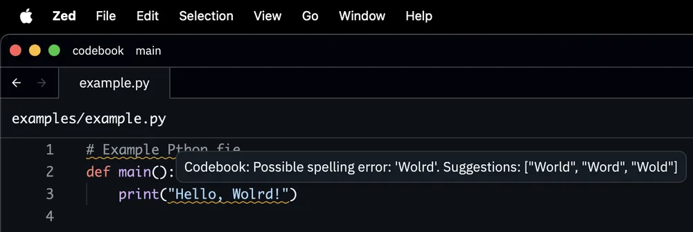

 

  
  <h3 align="center">CODEBOOK</h3>
  

      An unholy spellchecker for code.
     
     
    <!-- <a href="https://github.com/blopker/codebook/releases/latest/">Download</a> -->
     
     
    <a href="https://github.com/blopker/codebook/issues">Report Bug</a>
    ·
    <a href="https://github.com/blopker/codebook/issues">Request Feature</a>
  

## About

Codebook is a spellchecker for code. It binds together the venerable Tree Sitter and the fast spell checker [Spellbook](https://github.com/helix-editor/spellbook). Included is a Language Server for use in any editor. Everything is done in Rust to keep response times snappy and memory usage _low_.

## Status

Codebook is being developed and not yet ready for public (or private, really) use. Hit the Star button to follow for updates though. Currently only US English is supported.

### Supported Languages

| Language | Status |
| --- | --- |
| Markdown | ✅ |
| Plain Text | ✅ |
| HTML | ⚠️ |
| CSS | ⚠️ |
| Go | ⚠️ |
| JavaScript | ✅ |
| TypeScript | ⚠️ |
| Python | ⚠️ |
| Rust | ✅ |
| TOML | ✅ |

✅ = Good to go
⚠️ = Supported, but needs more testing

## Goals

Spellchecking is complicated and opinions about how it should be done, especially with code, differs. This section is about the trade offs that steer Codebook's decisions.

### Privacy

No remote calls for spellchecking or analytics. Once dictionaries are cached, Codebook needs to be usable offline. Codebook will never send the contents of files to a remote server.

### Don't be annoying

Codebook should have high signal and low noise. It should only highlight words that users have control over. For example, a misspelled word in an imported function should not be highlighted as the user can't do anything about it.

### Efficient

All features will be weighed against their impact on CPU and memory impact. Codebook should be fast enough to spellcheck on every keystroke on even low-end hardware.

## Features

### Code-aware spell checking

Codebook will only check the parts of your code where a normal linter wouldn't. Comments, string literals and variable definitions for example. Codebook knows how to split camel case and snake case variables, and makes suggestions in the original case.

### Language Server

Codebook comes with a language server. Originally developed for the Zed editor, this language server can be integrated into any editor that supports the language server protocol.

### Dictionary Management

Codebook comes with a dictionary manager, which will automatically download and cache dictionaries for a large number of written languages.

## Roadmap

- [ ] Support more languages than US English
- [ ] Support custom project dictionaries
- [ ] Support custom global dictionaries
- [ ] Support per file extension dictionaries
- [ ] Add code actions to correct spelling

## Running

Currently there are only tests.

Run them with `make test`.

## Acknowledgments
- Harper: https://writewithharper.com/
- Harper Zed: https://github.com/Stef16Robbe/harper_zed
- Spellbook: https://github.com/helix-editor/spellbook
- cSpell for VSCode: https://marketplace.visualstudio.com/items?itemName=streetsidesoftware.code-spell-checker
- Vale: https://github.com/errata-ai/vale-ls
- TreeSitter Visualizer: https://intmainreturn0.com/ts-visualizer/
- common-words: https://github.com/anvaka/common-words
- Hunspell dictionaries in UTF-8: https://github.com/wooorm/dictionaries

## Release

To update the Language server:

1. Run `make release-lsp`
1. Follow instructions
1. Go to GitHub Releases
1. Un-mark "prerelease" and publish
